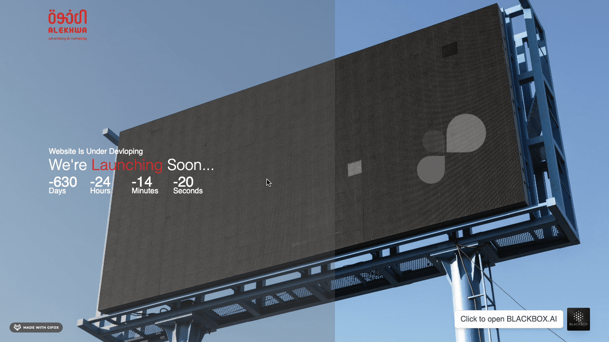

# Our First Project: A Deal That Never Saw the Light

Our first opportunity came from a job interview at an advertising company that, oddly enough, wanted to hire developers. I was the first to be interviewed, but it didn’t take long for me to realize that the interviewer wasn’t actually looking to hire us—he just needed a website for his company.

Sensing an opportunity, I proposed that instead of hiring us, he could simply buy the product from us. He agreed, and we had our first client!

We quickly built a prototype and delivered it, thinking we were off to a great start. However, after several arguments with the client, the project fell apart before it even launched. Our first deal crashed and burned, but we weren’t ready to give up just yet.

---

## About This Repository

This repository is a testament to our first experience as a development team. Though the project never saw the light of day, it was a stepping stone in our journey. It represents our passion, our lessons learned, and the start of something bigger.

## Demo



## Project Structure

```
.
├── README.md
├── bun.lockb
├── img
│   ├── Company logo alekwa -01-01.svg
│   ├── Company logo alekwa-011-01.svg
│   ├── SVG
│   │   └── Asset 1.svg
│   ├── bg 2.jpg
│   ├── bg.jpg
│   ├── favicon 2.ico
│   ├── favicon 3.ico
│   ├── favicon.ico
│   ├── loading.svg
│   ├── logo dalooh  01 -02-01.svg
│   ├── logo-png
│   │   ├── en.png
│   │   └── main.png
│   └── small2.svg
├── index.js
├── package-lock.json
├── package.json
├── public
│   ├── clint.js
│   └── style.css
├── scr
│   └── clock.js
└── views
    ├── 404.html
    └── index.html

7 directories, 23 files
```

## Package Information

```json
{
  "name": "alekhwa-comming-soon",
  "version": "1.0.0",
  "description": "alekhwa company",
  "main": "index.js",
  "scripts": {
    "start": "node index.js"
  },
  "repository": {
    "type": "git",
    "url": "git+https://github.com/alialghanay/alekhwa-comming-soon.git"
  },
  "keywords": ["alekhwa", "adverting"],
  "author": "alialghanay",
  "license": "MIT",
  "bugs": {
    "url": "https://github.com/alialghanay/alekhwa-comming-soon/issues"
  },
  "homepage": "https://github.com/alialghanay/alekhwa-comming-soon#readme",
  "dependencies": {
    "express": "^4.18.2"
  }
}
```

## Lessons Learned

This project taught us:

- How to negotiate with clients
- The importance of clear communication
- The challenges of project management

## Future Plans

Although this project was never completed, it laid the groundwork for our future endeavors. We took what we learned and applied it to bigger and better projects.

## License

MIT

---

This repository is a reminder that every failure is a step towards success. Thanks for stopping by!
